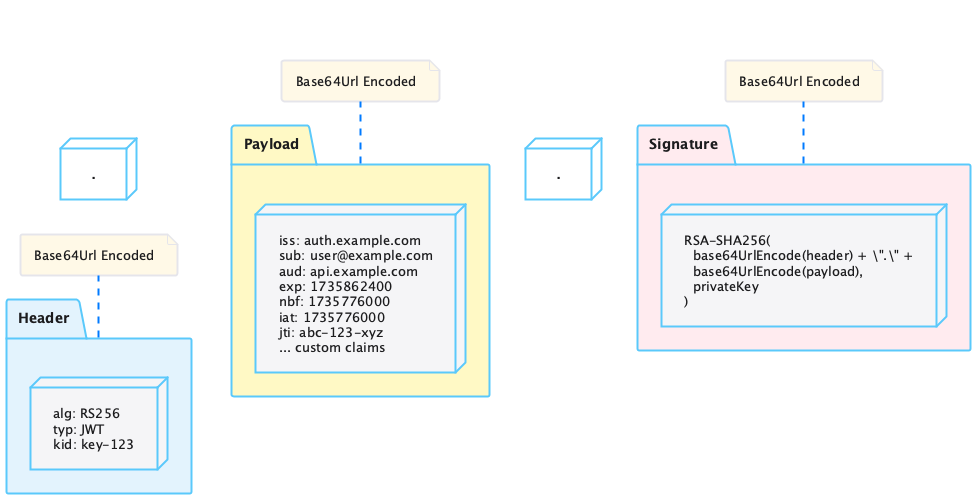

= JWT Token Handling Requirements
:toc: left
:toclevels: 3
:toc-title: Table of Contents
:sectnums:
:source-highlighter: highlight.js

== Overview

This document outlines the functional and non-functional requirements for the JWT Token Validation library.

=== Document Navigation

* link:../README.md[README] - Project overview and introduction
* xref:../token-sheriff-validation/doc/usage-guide.adoc[Usage Guide] - How to use the library with code examples
* xref:architecture.adoc[Architecture] - Architecture reference
* xref:LogMessages.adoc[Log Messages] - Reference for all log messages
* xref:security/threat-model.adoc[Threat Model] - Security analysis and mitigations

== Referenced Standards

The following standards and specifications are referenced in this document:

* https://datatracker.ietf.org/doc/html/rfc7519[RFC 7519 - JSON Web Token (JWT)] - May 2015
* https://datatracker.ietf.org/doc/html/rfc7518[RFC 7518 - JSON Web Algorithms (JWA)] - May 2015
* https://datatracker.ietf.org/doc/html/rfc7517[RFC 7517 - JSON Web Key (JWK)] - May 2015
* https://datatracker.ietf.org/doc/html/rfc7516[RFC 7516 - JSON Web Encryption (JWE)] - May 2015
* https://datatracker.ietf.org/doc/html/rfc6749[RFC 6749 - OAuth 2.0 Authorization Framework] - October 2012
* https://openid.net/specs/openid-connect-core-1_0.html[OpenID Connect Core 1.0] - November 2014
* https://datatracker.ietf.org/doc/html/rfc8725[RFC 8725 - JSON Web Token Best Current Practices] - February 2020 (updates RFC 7519)
* https://datatracker.ietf.org/doc/html/rfc9068[RFC 9068 - JSON Web Token (JWT) Profile for OAuth 2.0 Access Tokens] - October 2021
* https://datatracker.ietf.org/doc/html/rfc9449[RFC 9449 - OAuth 2.0 Demonstrating Proof of Possession (DPoP)] - September 2023
* https://datatracker.ietf.org/doc/html/draft-ietf-oauth-v2-1[OAuth 2.1 Authorization Framework] - Draft, in progress
* https://nvlpubs.nist.gov/nistpubs/SpecialPublications/NIST.SP.800-131Ar2.pdf[NIST SP 800-131A Revision 2] - March 2019
* https://www.rfc-editor.org/rfc/rfc8017.html[RFC 8017 - PKCS #1: RSA Cryptography Specifications Version 2.2] - November 2016

== OAuth 2.1 Compatibility

TokenSheriff is a **resource server token validation library**. It validates JWT tokens passed as strings and does not handle authorization flows, token issuance, redirect URIs, or HTTP transport.

The major changes in https://datatracker.ietf.org/doc/html/draft-ietf-oauth-v2-1[OAuth 2.1] (mandatory PKCE, removal of implicit and ROPC grants, exact redirect URI matching, refresh token rotation) target **authorization servers and clients**, not resource servers. **Tokens issued by OAuth 2.1 compliant servers validate correctly with TokenSheriff as-is**, since OAuth 2.1 does not change the JWT structure or introduce new mandatory claims for access tokens.

TokenSheriff already satisfies the OAuth 2.1 resource server requirements:

* **Scope enforcement** - `scope` claim accessible via `AccessTokenContent.getScopes()` for application-level validation; enforced declaratively via Quarkus `@BearerAuth`
* **Audience validation** - Supported via `expected-audience` configuration; mandatory for ID tokens
* **Token expiration check** - `exp` mandatory, with configurable clock skew tolerance
* **Algorithm security** - Whitelisted RS/ES/PS/EdDSA families only; HMAC and "none" rejected per https://datatracker.ietf.org/doc/html/rfc8725[RFC 8725]
* **Issuer validation** - `iss` mandatory, matched against configured issuers
* **Signature verification** - Full cryptographic validation pipeline
* **RFC 9068 token type validation** - Optional per-issuer `typ: at+jwt` header validation (see xref:#VALIDATION-8.6[VALIDATION-8.6])
* **RFC 9449 DPoP sender-constrained tokens** - Optional per-issuer DPoP proof validation binding access tokens to client public keys (see xref:#VALIDATION-8.7[VALIDATION-8.7])

NOTE: Requirement IDs are stable identifiers referenced across documentation and are not sequential. Functional requirements use IDs 1-8 and 12; non-functional requirements use IDs 9-10.

== Functional Requirements

[#VALIDATION-1]
=== VALIDATION-1: Token Parsing and Validation

The library must provide robust token parsing and validation capabilities in accordance with https://datatracker.ietf.org/doc/html/rfc7519[RFC 7519 - JSON Web Token (JWT)] (May 2015).

_See specifications: xref:architecture.adoc[Architecture] and xref:security/security-reference.adoc[Security Reference]_

[#VALIDATION-1.1]
==== VALIDATION-1.1: Token Structure

The library must support standard JWT token structure with header, payload, and signature as defined in RFC 7519 (May 2015).

_See specification: xref:architecture.adoc#token-types[Token Architecture and Types]_

[#VALIDATION-1.2]
==== VALIDATION-1.2: Token Types

The library must support different token types as defined in https://datatracker.ietf.org/doc/html/rfc6749[RFC 6749 - OAuth 2.0] (October 2012) and https://openid.net/specs/openid-connect-core-1_0.html[OpenID Connect Core 1.0] (November 2014):

* Access tokens
* ID tokens
* Refresh tokens

_See specification: xref:architecture.adoc#token-types[Token Architecture and Types]_

[#VALIDATION-1.3]
==== VALIDATION-1.3: Signature Validation

The library must validate token signatures using cryptographic algorithms as specified in https://datatracker.ietf.org/doc/html/rfc7518[RFC 7518 - JSON Web Algorithms (JWA)].

For security reasons, only the following signature algorithms shall be supported (in accordance with https://datatracker.ietf.org/doc/html/rfc8725[RFC 8725 - JSON Web Token Best Current Practices] (February 2020) and https://nvlpubs.nist.gov/nistpubs/SpecialPublications/NIST.SP.800-131Ar2.pdf[NIST SP 800-131A] (March 2019)):

* ES512 (ECDSA using P-521 and SHA-512)
* ES384 (ECDSA using P-384 and SHA-384)
* ES256 (ECDSA using P-256 and SHA-256)
* EdDSA (Edwards-curve Digital Signature Algorithm using Ed25519/Ed448)
* PS512 (RSASSA-PSS using SHA-512 and MGF1 with SHA-512)
* PS384 (RSASSA-PSS using SHA-384 and MGF1 with SHA-384)
* PS256 (RSASSA-PSS using SHA-256 and MGF1 with SHA-256)
* RS512 (RSASSA-PKCS1-v1_5 with SHA-512)
* RS384 (RSASSA-PKCS1-v1_5 with SHA-384)
* RS256 (RSASSA-PKCS1-v1_5 with SHA-256)

NOTE: ECDSA, EdDSA, and RSASSA-PSS algorithms are preferred over RSASSA-PKCS1-v1_5 (RS*). While RS* algorithms remain supported for broad interoperability, RSASSA-PSS (PS*) is recommended by https://www.rfc-editor.org/rfc/rfc8017.html#section-8[RFC 8017] (2016) as the successor scheme. EdDSA (Ed25519) is listed as a supported algorithm in the https://openid.net/specs/fapi-2_0-security-profile.html[FAPI 2.0 Security Profile] and is defined in https://datatracker.ietf.org/doc/html/rfc8037[RFC 8037 - CFRG Elliptic Curve Signatures in JOSE]. The default algorithm preference order reflects this: ECDSA > EdDSA > RSA-PSS > RSA PKCS#1 v1.5.

The following algorithms shall NOT be supported due to security concerns:

* HS256, HS384, HS512 (HMAC with SHA-2) - Vulnerable to https://auth0.com/blog/critical-vulnerabilities-in-json-web-token-libraries/[key confusion attacks] (2015) when used in combination with RSA public keys
* "none" algorithm - Explicitly forbidden by https://datatracker.ietf.org/doc/html/rfc8725#section-3.1[RFC 8725 Section 3.1 - Perform Algorithm Verification] and https://cwe.mitre.org/data/definitions/347.html[CWE-347: Improper Verification of Cryptographic Signature]
* RSA based algorithms with keys shorter than 2048 bits - Not compliant with https://nvlpubs.nist.gov/nistpubs/SpecialPublications/NIST.SP.800-131Ar2.pdf[NIST SP 800-131A] (2019)

Additional security considerations:

* The library must implement https://datatracker.ietf.org/doc/html/rfc8725#section-3.1[algorithm verification] to prevent algorithm substitution attacks (CVE-2015-9235)
* The library must validate that the algorithm specified in the JWT header matches the expected algorithm for the key
* The library must reject tokens with invalid signatures rather than falling back to less secure validation methods

_See specifications: xref:architecture.adoc#token-validation-pipeline[Token Validation Pipeline] and xref:security/security-reference.adoc#signature-validation[Signature Validation]_

[#VALIDATION-1.4]
==== VALIDATION-1.4: Token Decryption

The library supports decryption of encrypted JWT tokens (JWE) as defined in https://datatracker.ietf.org/doc/html/rfc7516[RFC 7516 - JSON Web Encryption (JWE)] (May 2015). JWE decryption is transparent — the pipeline detects 5-part JWE tokens, decrypts them using locally-configured private keys, and validates the inner JWS through the existing pipeline unchanged.

Supported key management algorithms: RSA-OAEP, RSA-OAEP-256, ECDH-ES. Supported content encryption algorithms: A128GCM, A256GCM, A128CBC-HS256, A256CBC-HS512. RSA1_5 is explicitly rejected due to Bleichenbacher's padding oracle attack.

_See specification: xref:specification/token-decryption.adoc[Token Decryption]_

[#VALIDATION-2]
=== VALIDATION-2: Token Representation

The library must provide type-safe token representations.

_See specification: xref:architecture.adoc#token-types[Token Architecture and Types]_

[#VALIDATION-2.1]
==== VALIDATION-2.1: Base Token Functionality

A base token representation must provide common token functionality:

* Access to token claims as defined in RFC 7519
* Expiration checking (exp claim)
* Issuer information (iss claim)
* Subject information (sub claim)
* Issued at time (iat claim)
* Not before time (nbf claim)
* JWT ID (jti claim)

_See specification: xref:architecture.adoc#token-types[Token Architecture and Types]_

[#VALIDATION-2.2]
==== VALIDATION-2.2: Access Token Functionality

The access token representation must provide:

* Scope-based authorization (scope claim) as defined in RFC 6749
* Role-based authorization (roles or groups claims)
* Resource access information

_See specification: xref:architecture.adoc#token-types[Token Architecture and Types]_

[#VALIDATION-2.3]
==== VALIDATION-2.3: ID Token Functionality

The ID token representation must provide user identity information as defined in OpenID Connect Core 1.0, including:

* User identity information (sub, name, preferred_username, email, etc.)
* Authentication context information (auth_time, acr, amr, etc.)

_See specification: xref:architecture.adoc#token-types[Token Architecture and Types]_

[#VALIDATION-2.4]
==== VALIDATION-2.4: Refresh Token Functionality

The refresh token representation must provide:

* Token refresh capabilities as defined in RFC 6749
* Token lifecycle management

_See specification: xref:architecture.adoc#token-types[Token Architecture and Types]_

[#VALIDATION-3]
=== VALIDATION-3: Multi-Issuer Support

The library must support tokens from multiple issuers.

_See specification: xref:architecture.adoc#multi-issuer[Multi-Issuer Support]_

[#VALIDATION-3.1]
==== VALIDATION-3.1: Issuer Configuration

Support configuration of multiple token issuers with different validation parameters.

_See specification: xref:architecture.adoc#multi-issuer[Multi-Issuer Support]_

[#VALIDATION-3.2]
==== VALIDATION-3.2: Issuer Selection

Automatically select the appropriate issuer configuration based on the token.

_See specification: xref:architecture.adoc#multi-issuer[Multi-Issuer Support]_

[#VALIDATION-3.3]
==== VALIDATION-3.3: Issuer Validation

Validate that tokens come from trusted issuers.

_See specification: xref:architecture.adoc#multi-issuer[Multi-Issuer Support]_

[#VALIDATION-4]
=== VALIDATION-4: Key Management

The library must support public key management for token validation in accordance with https://datatracker.ietf.org/doc/html/rfc7517[RFC 7517 - JSON Web Key (JWK)] (May 2015).

_See specifications: xref:architecture.adoc#jwks-integration[Key Management] and xref:security/security-reference.adoc#security-controls[Security Reference]_

[#VALIDATION-4.1]
==== VALIDATION-4.1: JWKS Endpoint Support

Support fetching public keys from JWKS endpoints as defined in https://datatracker.ietf.org/doc/html/rfc7517#section-5[RFC 7517 Section 5 - JWK Set Format] (May 2015).

_See specifications: xref:architecture.adoc#jwks-integration[JwksLoader]_

[#VALIDATION-4.2]
==== VALIDATION-4.2: Key Caching

Cache keys to improve performance with configurable cache expiration.

_See specification: xref:architecture.adoc#jwks-integration[JwksLoader]_

[#VALIDATION-4.3]
==== VALIDATION-4.3: Key Rotation

Support automatic key rotation based on configurable refresh intervals.

_See specification: xref:architecture.adoc#jwks-integration[JwksLoader]_

[#VALIDATION-4.4]
==== VALIDATION-4.4: Local Key Support

Support local key configuration for testing or offline scenarios.

_See specification: xref:architecture.adoc#jwks-integration[JwksLoader]_

[#VALIDATION-4.5]
==== VALIDATION-4.5: Key Rotation Grace Period

The library must support a configurable grace period for retired keys during key rotation to ensure uninterrupted service during the transition period, as recommended by general key management best practices.

Key requirements:

* Retain retired keys for a configurable grace period (default: 5 minutes)
* Support immediate key invalidation with zero grace period configuration
* Automatically clean up expired keys beyond the grace period
* Limit the number of retained retired key sets to prevent unbounded memory growth
* Prevent unnecessary key rotation when JWKS content has not changed

This ensures that tokens signed with recently rotated keys remain valid during the transition period, preventing service disruptions for in-flight requests.

_See specification: xref:architecture.adoc#jwks-integration[JwksLoader]_

[#VALIDATION-5]
=== VALIDATION-5: Token Parsing

Provide a mechanism for parsing token strings into structured representations.

_See specification: xref:architecture.adoc#token-validation-pipeline[TokenValidator]_

[#VALIDATION-5.1]
==== VALIDATION-5.1: Token Parsing Methods

The library must provide methods for parsing different token types:

* Access tokens
* ID tokens
* Refresh tokens

_See specification: xref:architecture.adoc#token-validation-pipeline[TokenValidator]_

[#VALIDATION-6]
=== VALIDATION-6: Configuration

Provide a flexible configuration mechanism for token validation.

_See specification: xref:architecture.adoc#multi-issuer[Configuration]_

[#VALIDATION-6.1]
==== VALIDATION-6.1: Configuration Flexibility

The configuration mechanism must support different validation settings for different token types and issuers.

_See specification: xref:architecture.adoc#multi-issuer[Configuration]_

[#VALIDATION-7]
=== VALIDATION-7: Logging

Implement comprehensive logging for troubleshooting and auditing, following the https://owasp.org/www-project-proactive-controls/v4/en/c9-security-logging-and-monitoring[OWASP Proactive Controls C9: Implement Security Logging and Monitoring] guidelines.

_See specifications: xref:architecture.adoc#securityeventcounter[SecurityEventCounter] and xref:security/security-reference.adoc#security-events-monitoring[Security Events]_

[#VALIDATION-7.1]
==== VALIDATION-7.1: Log Levels

Support different log levels for different types of events:

* ERROR: Authentication failures, token validation errors
* WARN: Suspicious activities, token format issues
* INFO: Successful token validations, key rotations
* DEBUG: Detailed token processing information
* TRACE: Highly detailed debugging information

_See specification: xref:architecture.adoc[Architecture]_

[#VALIDATION-7.2]
==== VALIDATION-7.2: Log Content

Log messages must include relevant information for troubleshooting without exposing sensitive data, as recommended by https://cheatsheetseries.owasp.org/cheatsheets/Logging_Cheat_Sheet.html[OWASP Logging Cheat Sheet].

* Include: timestamps, event types, source components, outcome (success/failure)
* Exclude: full tokens, private keys, passwords

_See specification: xref:architecture.adoc[Architecture]_

[#VALIDATION-7.3]
==== VALIDATION-7.3: Security Events

Log security-relevant events as recommended by https://datatracker.ietf.org/doc/html/rfc8417[RFC 8417 - Security Event Token (SET)] (July 2018):

* Token validation failures
* Key rotation events
* Configuration changes
* Suspicious token usage patterns

_See specifications: xref:architecture.adoc#securityeventcounter[SecurityEventCounter] and xref:security/security-reference.adoc#security-events-monitoring[Security Events]_

[#VALIDATION-8]
=== VALIDATION-8: Security

The library must implement security best practices as defined in the https://cheatsheetseries.owasp.org/cheatsheets/JSON_Web_Token_for_Java_Cheat_Sheet.html[OWASP JWT Security Cheat Sheet for Java].

_See specifications: xref:security/security-reference.adoc[Security Reference] and xref:security/threat-model.adoc[Threat Model]_

[#VALIDATION-8.1]
==== VALIDATION-8.1: Token Size Limits

Implement token size limits to prevent denial of service attacks. Maximum token size should be 8KB as recommended by general industry practice and common HTTP server defaults.

_See specifications: xref:architecture.adoc[Architecture (Size Limits)]_

[#VALIDATION-8.2]
==== VALIDATION-8.2: Safe Parsing

Implement safe parsing practices to prevent security vulnerabilities such as:

* JSON parsing attacks
* Injection attacks
* Deserialization vulnerabilities
For example, vulnerabilities could include issues like entity expansion in XML parsers (if applicable to the JSON parser's underlying mechanisms or if XML is also processed), or object injection if deserializing into complex type hierarchies without proper validation.

Refer to https://owasp.org/www-project-top-ten/[OWASP Top 10] (2021) for common vulnerabilities, particularly A8:2021-Software and Data Integrity Failures.

_See specification: xref:security/security-reference.adoc#safe-parsing[Safe Parsing]_

[#VALIDATION-8.3]
==== VALIDATION-8.3: Secure Communication

Support secure communication for key retrieval using TLS 1.2 or higher as recommended by https://nvlpubs.nist.gov/nistpubs/SpecialPublications/NIST.SP.800-52r2.pdf[NIST SP 800-52 Rev. 2] (2019).

_See specification: xref:security/security-reference.adoc#secure-communication[Secure Communication]_

[#VALIDATION-8.4]
==== VALIDATION-8.4: Claims Validation

Validate token claims according to RFC 7519 (May 2015) and OpenID Connect Core 1.0 (November 2014), including:

* Expiration time (exp)
* Not before time (nbf)
* Issuer (iss)
* Audience (aud)

_See specification: xref:security/security-reference.adoc#claims-validation[Claims Validation]_

[#VALIDATION-8.5]
==== VALIDATION-8.5: Cryptographic Agility

The library must support cryptographic agility as recommended by https://datatracker.ietf.org/doc/html/rfc8725#section-3.2[RFC 8725 Section 3.2 - Use Appropriate Algorithms], allowing for algorithm upgrades without breaking changes.

_See specification: xref:security/security-reference.adoc#cryptographic-agility[Cryptographic Agility]_

[#VALIDATION-8.6]
==== VALIDATION-8.6: Token Type Header Validation (RFC 9068)

The library must support optional per-issuer validation of the JWT `typ` header parameter as defined in https://datatracker.ietf.org/doc/html/rfc9068[RFC 9068 - JSON Web Token (JWT) Profile for OAuth 2.0 Access Tokens] (October 2021).

* When `expected-token-type` is configured for an issuer, tokens with a missing or mismatched `typ` header are rejected
* When not configured (default), no token type validation is performed
* Comparison is case-insensitive per RFC convention
* Validation occurs in the `TokenHeaderValidator` as part of the header validation pipeline step

_See specification: xref:architecture.adoc#token-validation-pipeline[Token Validation Pipeline]_

[#VALIDATION-8.7]
==== VALIDATION-8.7: DPoP Sender-Constrained Tokens (RFC 9449)

The library must support optional per-issuer validation of DPoP (Demonstrating Proof of Possession) sender-constrained tokens as defined in https://datatracker.ietf.org/doc/html/rfc9449[RFC 9449 - OAuth 2.0 Demonstrating Proof of Possession (DPoP)] (September 2023).

* When `dpop.enabled=true` for an issuer, tokens with a `cnf.jkt` claim are validated against the DPoP proof JWT from the `DPoP` HTTP header
* When `dpop.required=true`, tokens without a `cnf.jkt` claim are rejected
* When `dpop.required=false` (default), tokens without a `cnf.jkt` claim pass normally (bearer mode)
* DPoP validation includes: JWT format and signature verification, JWK Thumbprint (https://datatracker.ietf.org/doc/html/rfc7638[RFC 7638]) binding against `cnf.jkt`, access token hash (`ath`) verification, `iat` freshness check, and `jti` replay prevention
* Only asymmetric algorithms are permitted in DPoP proofs (HMAC and "none" are rejected)

_See specification: xref:architecture.adoc#token-validation-pipeline[Token Validation Pipeline]_

[#VALIDATION-12]
=== VALIDATION-12: Testing and Quality Assurance

_See specification: xref:security/security-reference.adoc[Security Reference]_

[#VALIDATION-12.1]
==== VALIDATION-12.1: Security Testing

The library must undergo comprehensive security testing according to https://cheatsheetseries.owasp.org/cheatsheets/JSON_Web_Token_for_Java_Cheat_Sheet.html[OWASP JWT Security Cheat Sheet for Java] (2023).

Key security tests must include:

* Token validation bypass tests
* Algorithm confusion attack tests
* Key disclosure vulnerability tests
* Signature verification bypass tests
* Token cracking resistance tests

_See specifications: xref:security/security-reference.adoc[Security Reference]_

[#VALIDATION-12.2]
==== VALIDATION-12.2: Unit Testing

The library must have comprehensive unit tests with at least 80% code coverage, including:

* Token parsing tests
* Token validation tests
* Error handling tests
* Edge case tests (malformed tokens, expired tokens, etc.)

_See specification: xref:architecture.adoc[Architecture]_

[#VALIDATION-12.3]
==== VALIDATION-12.3: Integration Testing

Integration tests must verify compatibility with multiple OIDC identity providers:

===== Keycloak (Primary)

* Parse access tokens from Keycloak
* Parse ID tokens from Keycloak
* Parse refresh tokens from Keycloak
* Validate tokens against Keycloak JWKS endpoint
* Handle token expiration and validation
* Bearer token validation with scopes, roles, and groups
* DPoP sender-constrained token validation (RFC 9449)
* JWE token decryption (RFC 7516)

===== Multi-IDP Compatibility

* Validate access tokens from alternative OIDC providers (Dex, Zitadel, etc.)
* Validate ID tokens from alternative OIDC providers
* Verify JWKS resolution via well-known discovery from multiple providers
* Ensure issuer selection correctly routes tokens to the matching provider configuration
* Tests for non-primary providers use conditional execution (skip when provider unavailable)

_See specifications: xref:architecture.adoc[Architecture] and xref:specification/multi-idp-testing.adoc[Multi-IDP Testing]_

[#VALIDATION-12.4]
==== VALIDATION-12.4: Vulnerability Scanning

The library must be regularly scanned for vulnerabilities using:

* Automated dependency vulnerability scanning for third-party dependencies
* Static Application Security Testing (SAST) tools
* Fuzz-Testing tools for input validation vulnerabilities

_See specification: xref:security/security-reference.adoc[Security Reference]_

[#VALIDATION-12.5]
==== VALIDATION-12.5: Compliance Testing

Tests must verify compliance with:

* https://openid.net/certification/[OpenID Connect Certification] requirements
* https://www.rfc-editor.org/rfc/rfc7519[RFC 7519] JWT specification
* https://datatracker.ietf.org/doc/html/rfc8725[RFC 8725 - JSON Web Token Best Current Practices]

_See specification: xref:security/security-reference.adoc[Security Reference]_

== Non-Functional Requirements

[#VALIDATION-9]
=== VALIDATION-9: Performance

Performance requirements are verified through comprehensive benchmarking:

* **Micro-benchmarks** (JMH): Library-level performance testing
* **Integration benchmarks** (WRK): End-to-end HTTP performance testing

_See analysis: xref:../benchmarking/doc/Analysis-03.2026-Micro.adoc[Micro-Benchmark Analysis] and xref:../benchmarking/doc/Analysis-03.2026-Integration.adoc[Integration Benchmark Analysis]_

[#VALIDATION-9.1]
==== VALIDATION-9.1: Library Performance (Micro-Benchmarks)

**Requirements:**

* JWT validation throughput: > 100,000 ops/s (100 concurrent threads)
* Average validation latency: < 0.7ms
* P99 validation latency: < 0.2ms
* Cache lookup latency (P50): < 0.2µs

**Measured Performance (JMH on Apple M4, 100 threads):**

* **Core validation**: 159,100 ops/s
* **Average latency**: 0.657ms
* **P50 latency**: 77µs (P95: 80µs, P99: 163µs)
* **Signature validation**: P50=68µs (88% of total time)
* **Cache operations**: P50=0.1µs
* **Token parsing**: P50=4.3µs

_See detailed analysis: xref:../benchmarking/doc/Analysis-03.2026-Micro.adoc[Micro-Benchmark Analysis (March 2026)]_

[#VALIDATION-9.2]
==== VALIDATION-9.2: Error Handling Performance

**Requirements:**

* Invalid token validation: < 2ms average time
* Error throughput improvement: Fast-fail on invalid tokens should improve throughput

**Measured Performance (JMH on Apple M4, 100 threads):**

* **All valid tokens**: 152,200 ops/s
* **50% invalid tokens**: 222,300 ops/s (+39% throughput improvement)
* **Fast-fail optimization**: Invalid tokens rejected early without full processing

_See detailed analysis: xref:../benchmarking/doc/Analysis-03.2026-Micro.adoc#_throughput_results[Throughput Results]_

[#VALIDATION-9.3]
==== VALIDATION-9.3: Integration Performance (HTTP/REST)

**Requirements:**

* HTTP JWT validation: > 20,000 ops/s (150 connections, stress profile)
* P50 latency: < 10ms
* P99 latency: < 50ms
* Health check baseline: > 60,000 ops/s
* Zero timeout errors

**Measured Performance (WRK on Apple M4, Docker, 150 connections):**

* **JWT validation (cache enabled)**: 25,178 ops/s
* **P50 latency**: 5.49ms (P90: 15.73ms, P99: 32.59ms)
* **Health check**: 88,700 ops/s
* **Error rate**: 0% timeouts
* **CPU usage**: 85.0% peak, 79.7% average (JWT with cache)

_See detailed analysis: xref:../benchmarking/doc/Analysis-03.2026-Integration.adoc[Integration Benchmark Analysis (March 2026)]_

[#VALIDATION-9.4]
==== VALIDATION-9.4: Cache Performance

**Requirements:**

* Cached key lookup: < 0.5µs P50
* Cache hit rate: > 95% (appropriate cache size)
* Cache effectiveness: Measurable throughput improvement with caching enabled

**Measured Performance:**

* **Cache lookup**: P50=0.1µs (P95: 0.4µs)
* **Cache store**: P50=0.1µs (P95: 0.5µs)
* **Cache hit rate**: 100% (cache size 20, integration tests)
* **Cache effectiveness**: 100% hit rate with cache size 20 across all connection levels
* **Cached validation time**: 0.26ms average per token

_See analysis: xref:../benchmarking/doc/Analysis-03.2026-Integration.adoc[Integration Performance Analysis]_

[#VALIDATION-9.5]
==== VALIDATION-9.5: Scalability and Concurrency

**Requirements:**

* Stable performance across 50-300 concurrent connections
* Consistent JWT throughput: 20,000-22,000 ops/s regardless of connection count
* Thread scaling: Efficient scaling up to 100+ threads

**Measured Performance:**

* **JWT stability**: 22.7-24.3K ops/s across 50-300 connections
* **Optimal configuration**: 100 connections (95.4K health, 24.3K JWT)
* **Thread scaling**: 100 concurrent threads with 159K ops/s (library)
* **Latency scaling**: P50 increases linearly with connections (5.49ms @ 150 conns)

_See analysis: xref:../benchmarking/doc/Analysis-03.2026-Integration.adoc#_connection_sweep_50_300_connections[Connection Scaling Analysis]_

[#VALIDATION-10]
=== VALIDATION-10: Reliability

_See specification: xref:architecture.adoc#token-validation-pipeline[Token Validation Pipeline]_

[#VALIDATION-10.1]
==== VALIDATION-10.1: Thread Safety

The implementation must be thread-safe.

_See specification: xref:architecture.adoc#multi-issuer[Multi-Issuer Support]_

[#VALIDATION-10.2]
==== VALIDATION-10.2: Error Handling

The implementation must handle errors gracefully and provide meaningful error messages.

_See specification: xref:architecture.adoc#token-validation-pipeline[Token Validation Pipeline]_
