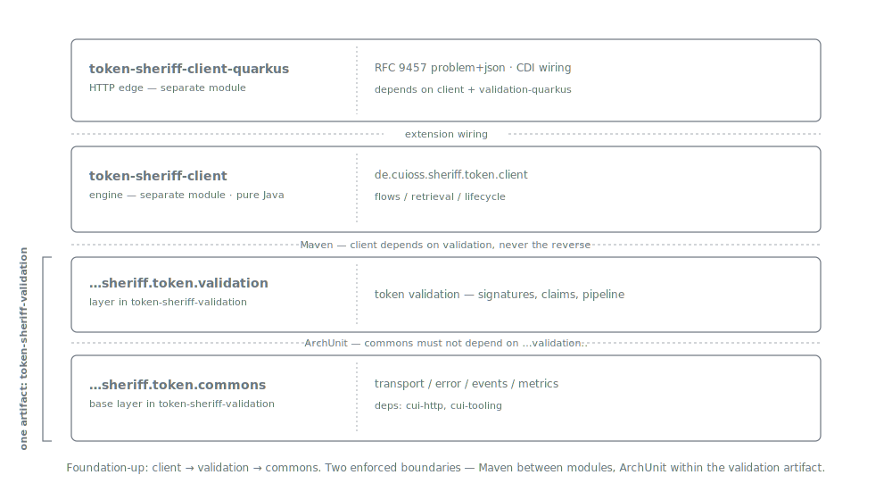
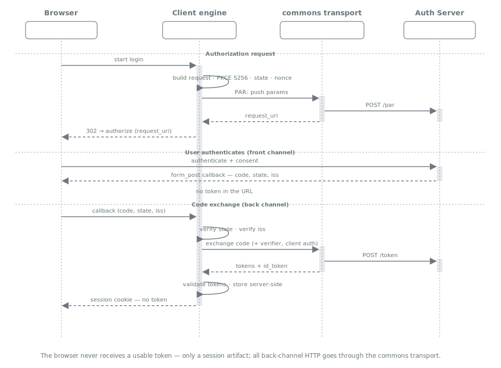

= Client Architecture
:toc: left
:toclevels: 3
:toc-title: Table of Contents
:sectnums:
:source-highlighter: highlight.js

== Overview

_See xref:requirements.adoc[Client Requirements], xref:threat-model.adoc[Threat Model],
xref:best-practices.adoc[Best Practices] and the
xref:../oidc/decision-oidc-module.adoc[module-architecture decision]._

The `client` capability is the *active* OIDC side: a server-side *confidential-client engine*
that retrieves tokens, holds and refreshes them server-side, and drives the flows on top of
the xref:../commons/architecture.adoc[commons] transport. It is the engine a
*Backend-For-Frontend (BFF)* is built on — *it is not itself a BFF*. This document maps the
engine's components, its boundaries with commons and validation, and the sequences it drives.

[IMPORTANT]
====
*We do not build a BFF here.* The BFF is a separate application layered on top of this
engine. This capability's job is to specify the engine so that *building a BFF on top stays
feasible and is not made unnecessarily complicated*. The BFF deployment shapes below are
documented only as the *consumers the design must keep viable*
(xref:requirements.adoc#CLIENT-19[CLIENT-19]), not as features delivered here.
====

== Position in the module architecture

* The engine is *pure Java* (xref:requirements.adoc#CLIENT-21[CLIENT-21]) — no CDI /
  MicroProfile / JAX-RS inside it. It depends on `token-sheriff-validation`, which
  transitively provides the `commons` base layer.
* The `client → validation` dependency direction is enforced by *Maven* — the
  `token-sheriff-client` module (created by
  xref:../oidc/05-client-module/README.adoc[Plan 05]) declares the dependency; it never
  reverses.
* The HTTP edge (`token-sheriff-client-quarkus`, or a future RESTEasy / portal adapter) maps
  the engine's typed exceptions to `application/problem+json`
  (xref:requirements.adoc#CLIENT-20[CLIENT-20], `COMMONS-10`).

NOTE: The Maven module (`token-sheriff-client`), the `token-sheriff-client-quarkus`
extension, and the BOM/reactor assembly were delivered by
xref:../oidc/05-client-module/README.adoc[Plan 05]. This document specifies the engine those
modules host.

== The engine seam

The engine owns three responsibilities and *delegates the rest*:

[cols="1,3", options="header"]
|===
| Concern | Where it lives

| *Retrieval & flow* — construct the authorization request (PKCE, `state`, `nonce`,
  `acr_values`, PAR); exchange the code; authenticate to the token endpoint; request
  sender-constrained tokens; drive step-up and RP-initiated logout.
| *This engine* (`client`), xref:specification/retrieval-flow.adoc[retrieval-flow] +
  xref:specification/step-up-and-logout.adoc[step-up-and-logout] specs.

| *Server-side token lifecycle* — hold, refresh (with rotation), revoke; preserve
  sender-constraint; keep tokens off the browser.
| *This engine* (`client`), xref:specification/token-handling.adoc[token-handling] spec.

| *Token trust* — signature, algorithm policy, `iss`/`aud`/`exp`/`iat`, DPoP proof.
| *validation* module (inherited; `CLIENT-15` calls it, never re-implements it).

| *Outbound OIDC/OAuth back-channel HTTP* — discovery, token, userinfo, revocation, PAR;
  TLS-scheme enforcement, in-module egress/path validation, bounded reads, timeouts.
| *This engine* (`client`) — it performs its *own* hardened HTTP, building `cui-http`
  `HttpHandler`s directly and applying an in-module egress control uniformly through the
  shared `BackChannelHttp` helper; it does *not* route these fetches through a commons
  transport façade. JWKS retrieval and the token-signature transport stay with the
  xref:../commons/architecture.adoc[commons]-backed *validation* pipeline.

| *Error rendering* — typed exceptions → `application/problem+json`.
| Engine *throws* (`COMMONS-9`); the *HTTP edge renders* (`COMMONS-10`).
|===

The seam is deliberately narrow: the engine is the *policy* layer (which parameters, which
order, which checks) and *drives its own hardened OIDC/OAuth back-channel HTTP* on top of the
`cui-http` transport primitives (`HttpHandler`, TLS, the `de.cuioss.http.security` egress
pipeline); validation is the *trust* layer. The engine reuses commons' transport *library*,
but it no longer delegates the OIDC/OAuth back-channel fetches to a commons transport service —
see <<_owned_back_channel_http>>.

== Confidential authorization-code + PKCE sequence

The core in-scope flow (xref:requirements.adoc#CLIENT-1[CLIENT-1], server-side, no tokens in
the browser):

The *browser never receives a usable token*. What the browser holds is the BFF's own
session artifact — see <<_bff_binding_shapes>>.

== [[_bff_binding_shapes]] BFF binding shapes (enabled, not built here)

A BFF built on this engine binds the acquired tokens to the browser session one of two ways;
in *both*, the token stays inaccessible to the browser, and the engine seam is *identical*
(xref:requirements.adoc#CLIENT-19[CLIENT-19]):

[cols="1,3", options="header"]
|===
| BFF deployment | How the token is bound to the browser session

| *Stateful BFF — server-side token store*
| The browser holds an opaque *session-id cookie*; tokens live in a *server-side store* and
  the backend *proxies* every resource-server call.

| *Stateless BFF — encrypted token cookie*
| The access token reaches the browser only inside an *HttpOnly cookie encrypted with a
  server-side symmetric key*; the backend *decrypts* it per request. No server-side store.
|===

What differs — a server-side store vs. an encrypted cookie — is the *BFF application's*
concern (session cookie, symmetric-key management, backend-API CSRF, request proxying,
login/consent UX, logout *receivers*). The engine must *enable either without forcing the
choice*; it implements neither.

== Boundaries enforced

* *Engine → validation* (Maven): the engine validates every retrieved token via the
  validation pipeline (`CLIENT-15`); it never re-implements signature/claim checks.
* *Engine owns its back-channel HTTP*: the engine drives its *own* outbound OIDC/OAuth
  back-channel HTTP (discovery, token, userinfo, revocation, PAR) on the `cui-http` transport
  library, and applies its own in-module egress control before each fetch
  (<<_owned_back_channel_http>>). It reuses commons' transport *primitives* (`HttpHandler`, TLS,
  the `de.cuioss.http.security` pipeline), not a commons transport *service*.
* *Engine throws, edge renders*: the pure-Java engine throws commons typed exceptions
  (`COMMONS-9`); only the HTTP edge produces problem+json (`CLIENT-20`, `COMMONS-10`).
* *Engine ≠ BFF*: the browser session / cookie layer is out of the engine entirely
  (`CLIENT-19`).

== [[_owned_back_channel_http]] Owned back-channel HTTP and its egress control

The five OIDC/OAuth back-channel clients — `DiscoveryResolver`, `TokenEndpointClient`,
`ParClient`, `UserInfoClient`, `RevocationClient` — construct and drive their *own* `cui-http`
`HttpHandler` calls rather than delegating to a commons transport service. This is a deliberate
design choice (the archived *"design fork 1"* recorded in the class javadoc) that was previously
*not* reflected in this document; an earlier revision claimed the engine "issues no HTTP of its
own." That claim was false and is corrected here.

Because a discovery document is only transport-authenticated — not fully trusted — a hostile or
mix-up-controlled AS could point a credential-bearing back-channel `POST` at an unintended
target. The engine therefore *owns* an in-module egress control, applied uniformly by the shared
`BackChannelHttp` helper before every fetch:

[cols="1,3", options="header"]
|===
| Control | What it does

| *Egress / path validation* | Each discovery-advertised endpoint URL is run through the
  `de.cuioss.http.security` URL-path validation pipeline, so a traversal / injection /
  encoding-evasion / malformed advertised path is *rejected before it is fetched*, surfacing as
  a `TransportException`.
| *Scheme / TLS enforcement* | A non-TLS (`http://`) endpoint is refused unless cleartext is
  explicitly enabled, via the `HttpHandler` builder's TLS enforcement.
| *Bounded reads & timeouts* | Response bodies are size-capped *during* the read
  (`BoundedContentBodyHandler`); connect / read timeouts come from `ClientConfiguration`.
|===

[IMPORTANT]
====
*Scope of the egress control.* It validates the advertised URL's *path structure and scheme* —
it is *not* a host-address SSRF allow-list and does not block internal / link-local addresses by
IP. Host-address reachability filtering, if required by a deployment, remains a network- or
commons-level concern. This document states the control the client actually applies, and no more.
====

== Reference & replacement target: portal-authentication-oauth

[NOTE]
====
*Design reference only.* `cui-portal-core`'s
`modules/authentication/portal-authentication-oauth` is an existing confidential server-side
OIDC client (CDI + MicroProfile Config + RESTEasy/JAX-RS) — effectively a BFF-style RP that
already implements most of the in-scope flow (auth-code + PKCE `S256`, `state`, light
`nonce`, `client_credentials`, refresh, discovery, userinfo, RP-initiated logout with
`id_token_hint`; tokens held in the portal session).

It grounds this capability's scope and is the *eventual replacement target* — the engine
would supersede it via a thin portal adapter preserving the portal contract (`Oauth2Service`,
`Oauth2AuthenticationFacade`, `OauthRedirector`, `OidcRpInitiatedLogoutParams`, result type
`AuthenticatedUserInfo`; config namespace `authentication.oidc.*`). That replacement — the
adapter and its integration tests — is *future work beyond Plans 01–06*; no current plan
touches it. The modernization deltas it motivates (cryptographic ID-token validation via the
validation module, `iss` mix-up defence, `private_key_jwt`/mTLS, PAR, DPoP/mTLS
sender-constraining, stronger `nonce`, in-module hardened back-channel HTTP with an egress/path
control) are each captured as sourced `CLIENT-N` requirements above.
====

== See also

* xref:requirements.adoc[Client Requirements] — `CLIENT-N`, grouped by aspect
* xref:threat-model.adoc[Client Threat Model]
* xref:best-practices.adoc[Client Best Practices]
* xref:specification/retrieval-flow.adoc[Retrieval & flow specification]
* xref:specification/step-up-and-logout.adoc[Step-up & logout specification]
* xref:specification/token-handling.adoc[Token-handling specification]
* xref:specification/test-strategy.adoc[Test-strategy specification]
* xref:../oidc/04-client-spec/README.adoc[Plan 04 — Client Spec]
