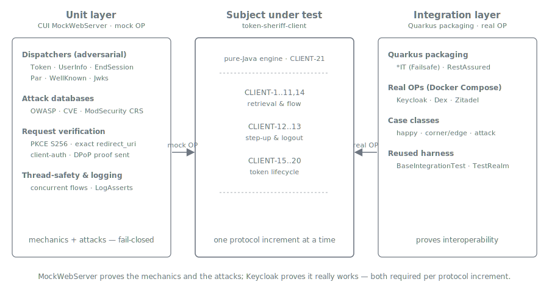

= Client Specification — Test Strategy
:toc: left
:toclevels: 3
:sectnums:
:source-highlighter: highlight.js

== Overview

_Realizes xref:../requirements.adoc#CLIENT-22[CLIENT-22] (thread safety + adversarial test
coverage) and is the test specification the xref:../../oidc/06-implement/README.adoc[Plan 06]
implementation executes. See xref:../threat-model.adoc[Threat Model],
xref:../requirements.adoc[Requirements], xref:../best-practices.adoc[Best Practices] and
xref:../architecture.adoc[Architecture]._

This specification defines *how the client engine is verified* — the test surface that every
`CLIENT-N` requirement, and every threat in the xref:../threat-model.adoc[threat model], is
proven against. It is the source of truth for the two-layer testing model
xref:../../oidc/06-implement/README.adoc[Plan 06] carries out increment by increment; Plan 06
backtracks to this document rather than re-deriving the model.

The strategy has *two layers that are never conflated*:

* *Unit layer* — in `token-sheriff-client/src/test`, using *CUI MockWebServer* to simulate a
  controllable OpenID Provider. This is where the *mechanics* and the *adversarial* coverage
  live, because only a controllable mock can emit malicious metadata, tampered tokens, PKCE
  downgrades, wrong `iss`, injected codes, open-redirect logout responses, or oversized
  bodies. The engine is pure Java (xref:../requirements.adoc#CLIENT-21[CLIENT-21]), so it is
  unit-tested with no CDI / Quarkus in the loop.
* *Integration layer* — Failsafe `*IT` tests running the *Quarkus-packaged* engine against
  *real* OpenID Providers (Keycloak always-on; Dex and Zitadel profile-gated), reusing the
  existing xref:../../oidc/06-implement/README.adoc[in-repo] Docker-Compose harness. This
  proves each protocol *actually interoperates* with a real OP, across *happy*,
  *corner / edge* and *attack* case classes.

[IMPORTANT]
====
The user-facing rule (xref:../../oidc/06-implement/README.adoc[Plan 06]): *MockWebServer
proves the mechanics and the attacks; Keycloak proves it really works.* Both layers are
required for every protocol increment — neither substitutes for the other.
====

== The two test layers

The layers are complementary, not redundant:

[cols="1,2,2", options="header"]
|===
| Question the layer answers | Unit (MockWebServer) | Integration (real Keycloak)

| Does the engine *send* the right request?
| Yes — assert the recorded request (PKCE `S256`, exact `redirect_uri`, client-auth method,
  `id_token_hint`, DPoP proof).
| Implicitly — the real OP rejects a wrong request.

| Does the engine *reject* a malicious response?
| *Primary home* — the adversarial dispatcher modes emit responses a conformant OP never
  would.
| Only the subset a real OP can naturally produce (e.g. a genuinely expired token).

| Does the protocol *actually interoperate*?
| No — a mock cannot prove conformance.
| *Primary home* — the protocol runs end-to-end against a real OP.

| Provider-quirk / real-world edge behaviour?
| No.
| *Primary home* — parameterized across Keycloak / Dex / Zitadel.
|===

== Unit layer — MockWebServer

=== Placement and reuse

The engine's unit tests live in `token-sheriff-client/src/test/java`, organized *by aspect /
protocol* (mirroring the production packages) with the CUI `*Test` naming convention and AAA
structure — the same layout as `token-sheriff-validation` (`@DisplayName`, `@Nested`,
`ShouldHandleObjectContracts` value-object contracts for client config / response records).

The OP simulators are *not re-authored*: `token-sheriff-validation` already publishes its test
utilities as a *test-jar with classifier `generators`* (its `maven-jar-plugin` `test-jar`
goal, xref:../../oidc/03-commons/README.adoc[Plan 03]). The client test module declares that
test-jar dependency (a xref:../../oidc/06-implement/README.adoc[Plan 06] wiring step — the
`token-sheriff-client` pom does not yet declare it) and reuses:

* the OP-endpoint dispatchers — `TokenDispatcher`, `UserInfoDispatcher`,
  `RevocationDispatcher`, `IntrospectionDispatcher`, `EndSessionDispatcher`, `ParDispatcher`,
  and the relocated `WellKnownDispatcher` / `JwksResolveDispatcher`
  (xref:../../commons/specification/transport.adoc#adversarial_dispatchers[commons transport
  spec], `COMMONS-7`);
* the shared adversarial payloads (`AdversarialResponses`, e.g. oversized-body DoS payloads)
  and the token-tampering utility (`JwtTokenTamperingUtil`);
* the key material / token helpers (`InMemoryKeyMaterialHandler`, `TestTokenHolder`) and the
  generator bridge (`@EnableGeneratorController` + `@TestTokenSource`).

=== Framework and conventions

Follow the CUI xref:../references.adoc#_supporting_sources_informative[cui-http-testing]
standards (`cui-test-mockwebserver-junit5`):

* `@EnableMockWebServer` on the test class; wire a dispatcher via the conventional
  `moduleDispatcher` field (Lombok `@Getter`) or a raw `MockWebServer` + `CombinedDispatcher`
  aggregating several endpoint dispatchers for a multi-endpoint flow.
* `@EnableMockWebServer(useHttps = true)` and injected `SSLContext` — the engine's outbound
  HTTP is TLS-only (`COMMONS-2`), so mock endpoints are HTTPS.
* Inject `URIBuilder` to construct endpoint URIs — never hard-code ports.
* Drive dispatcher behaviour with the fluent `returnDefault()` / `returnError()` /
  `returnMalformedBody()` / `returnOversizedBody()` mutators and verify with
  `assertCallsAnswered(int)` / the call counter. (`@MockResponseConfig` is available for
  trivial single-endpoint cases, but programmable dispatchers are the primary pattern.)
* Assert structured security events with `LogAsserts` + `@EnableTestLogger` (the engine logs
  via `CuiLogger` / `LogRecord`).

=== What the unit layer owns

[cols="1,3", options="header"]
|===
| Category | What the tests do

| *Mechanics (happy path)*
| Each protocol's request/response construction and interpretation against the dispatcher's
  *default* mode — discovery, `client_credentials`, code exchange, refresh, userinfo,
  revocation, end-session, PAR.

| *Request verification*
| Inspect the `RecordedRequest` and assert the engine *sent* the secure form: `S256`
  `code_challenge_method` (xref:../requirements.adoc#CLIENT-2[CLIENT-2]), a single exact
  `redirect_uri` (xref:../requirements.adoc#CLIENT-7[CLIENT-7]), the configured client-auth
  method and *never a secret in a URL* (xref:../requirements.adoc#CLIENT-4[CLIENT-4]), the
  `id_token_hint` / `state` on logout, the DPoP proof on a sender-constrained request. This is
  coverage a response-only test cannot give.

| *Adversarial (fail-closed)*
| Drive each dispatcher's *adversarial* mode and assert the engine *rejects* — see
  <<_adversarial_coverage>>. Every threat in the xref:../threat-model.adoc[threat model] MUST
  have a unit test that fails closed.

| *Thread safety* (xref:../requirements.adoc#CLIENT-22[CLIENT-22])
| Concurrent flows over shared per-issuer configuration; assert no cross-flow leakage of
  `state` / `nonce` / `code_verifier` / stored tokens.

| *Boundary*
| ArchUnit rules assert the engine contains no CDI / MicroProfile / JAX-RS
  (xref:../requirements.adoc#CLIENT-21[CLIENT-21]) and depends on `validation` only, never the
  reverse.
|===

=== [[_adversarial_coverage]] Adversarial coverage — dispatchers and attack databases

Two adversarial mechanisms, applied where each fits:

*Dispatcher adversarial modes* — for malicious *OP responses* (the bulk of the flow / token
threats). Each dispatcher emits the response only a hostile or misconfigured OP would, and the
test asserts rejection:

[cols="1,3", options="header"]
|===
| Threat | Adversarial unit test (dispatcher mode)

| xref:../threat-model.adoc#T-PKCE-DOWNGRADE[T-PKCE-DOWNGRADE]
| `WellKnownDispatcher` omits `S256` from `code_challenge_methods_supported` → the request is
  refused, never downgraded to `plain` / no-PKCE.

| xref:../threat-model.adoc#T-CODE-INJECTION[T-CODE-INJECTION]
| `TokenDispatcher` rejects a code presented without the matching `code_verifier`; an ID token
  with a mismatched `nonce` is rejected.

| xref:../threat-model.adoc#T-CSRF[T-CSRF] / xref:../threat-model.adoc#T-REDIRECT[T-REDIRECT]
| Callback handling rejects a missing / mismatched `state`; only an exact `redirect_uri` is
  accepted.

| xref:../threat-model.adoc#T-MIXUP[T-MIXUP]
| `WellKnownDispatcher` advertises a mismatched `issuer` / the `iss` response parameter differs
  from the initiating issuer → rejected *before* the code is exchanged.

| xref:../threat-model.adoc#T-PARAM-INTEGRITY[T-PARAM-INTEGRITY]
| `ParDispatcher` returns a `request_uri`; the front-channel redirect is asserted to carry
  *only* that `request_uri`, never the raw authorization parameters.

| xref:../threat-model.adoc#T-AUD-CONFUSION[T-AUD-CONFUSION] / xref:../threat-model.adoc#T-IDTOKEN-INTEGRITY[T-IDTOKEN-INTEGRITY]
| `TokenDispatcher` / `UserInfoDispatcher` emit tampered claims (via `JwtTokenTamperingUtil`)
  and a userinfo `sub` mismatch → the validation pipeline rejects; the `sub` binding is
  enforced.

| xref:../threat-model.adoc#T-REFRESH-THEFT[T-REFRESH-THEFT]
| `TokenDispatcher` refresh mode drives rotation; a reused rotated refresh token triggers
  *family revocation*.

| xref:../threat-model.adoc#T-LOGOUT[T-LOGOUT]
| `EndSessionDispatcher` returns an open-redirect / mismatched `post_logout_redirect_uri` →
  rejected; revocation of held tokens is asserted.

| xref:../threat-model.adoc#T-CONSTRAINT-LOSS[T-CONSTRAINT-LOSS]
| A DPoP / mTLS-bound token is asserted to keep its binding across storage and refresh.
|===

*Attack databases* — for untrusted *input parsing* inside the engine (callback query
parameters, the RFC 9470 `WWW-Authenticate` challenge, `post_logout_redirect_uri`
comparison). Rather than a handful of hand-picked payloads, drive the curated
`de.cuioss.http.security.database` corpora (`OWASPTop10AttackDatabase`,
`ApacheCVEAttackDatabase`, `ModSecurityCRSAttackDatabase`) through
`@ArgumentsSource(...AttackDatabase.ArgumentsProvider.class)`, asserting the parser rejects
each encoding-evasion / injection variant. This keeps the adversarial corpus comprehensive and
maintained upstream.

NOTE: The unit layer does *not* re-test what other modules own. Signature / algorithm policy
and claim trust are the xref:../../validation/requirements.adoc[validation] pipeline's
(`VALIDATION-*`); TLS / SSRF / size-limit transport hardening is `commons`'s
(`COMMONS-1`–`COMMONS-8`). The client tests assert it *invokes* those controls and reacts
correctly — they do not duplicate their internal tests.

== Integration layer — real Keycloak

=== Placement and harness

Integration tests are Failsafe `*IT` classes that exercise the *Quarkus-packaged* engine
(`token-sheriff-client-quarkus`) against real OPs. They extend the existing in-repo harness in
the `token-sheriff-quarkus-integration-tests` module rather than standing up a new one:

* a `docker-compose` topology (not Testcontainers) — *Keycloak always-on*, *Dex* and *Zitadel*
  profile-gated, Postgres backing Zitadel;
* `*IT` bound to `maven-failsafe-plugin` under an *opt-in* profile (`skipITs` defaults to
  `true`; the `integration-tests` profile flips it and brings the compose stack up in
  `pre-integration-test`, down in `post-integration-test`);
* `BaseIntegrationTest` (RestAssured against the mapped HTTPS port) and the `TestRealm` /
  `TestProviders` / `Capability` model, which already performs client-side token acquisition
  (`obtainValidToken()`, `obtainDpopBoundToken()`) — the exact flows the client module
  implements.

image::../../resources/diagrams/multi-idp-test-topology.svg["Multi-IdP integration-test container topology — one Docker Compose network hosting the integration-test runner and the Keycloak (always-on) / Dex / Zitadel (profile-gated) providers, with Postgres backing Zitadel", align=center]

Tests are *provider-agnostic* (parameterized over `TestProviders`) where the protocol is
portable, and *Keycloak-specific* where it is not; provider-specific capabilities (PAR, DPoP)
are gated via `TestRealm.Capability` so a provider that does not advertise a feature is skipped
rather than failed.

=== The three case classes

Each protocol increment contributes to *three* integration case classes (the user-facing split
this specification mandates):

[cols="1,3", options="header"]
|===
| Case class | What it proves

| *Happy cases*
| The protocol interoperates with a real OP end-to-end: discovery against `.well-known`; a
  `client_credentials` token validated by the pipeline; each client-auth method accepted; a
  refresh cycle with rotation; a full auth-code + PKCE login and code exchange; PAR (where
  advertised); userinfo fetch and `sub` binding; a DPoP-bound token; RP-initiated logout; and
  the full-flow E2E (login → token → userinfo → refresh → logout).

| *Corner / edge cases*
| Real-world boundaries a mock glosses over: access-token expiry boundaries and clock skew;
  concurrent / racing refresh; refresh-rotation continuity; optional / absent claims; provider
  quirks across Keycloak / Dex / Zitadel; the `max_age` boundary for step-up; and graceful
  behaviour when an *optional* capability (PAR, DPoP) is *not* advertised.

| *Attack / adversarial cases*
| The threat-model behaviour a *real* OP can exercise: a mismatched `state` / `nonce` rejected;
  a wrong `iss` (mix-up, using two real providers) rejected before exchange; an injected /
  replayed code refused; a tampered / expired token rejected by the pipeline; a reused rotated
  refresh token triggering family revocation; a logout open-redirect via an unmatched
  `post_logout_redirect_uri` rejected; a held token confirmed *revoked* after logout; and an
  `insufficient_user_authentication` response whose re-driven `acr` / `auth_time` does not
  satisfy the requirement *not* treated as a successful step-up.
|===

The division of labour with the unit layer is deliberate: adversarial *responses that only a
mock can emit* (malformed metadata, oversized bodies, forged signatures) stay in the unit
layer; the integration attack cases assert the *client's own rejection behaviour* and the
protections a real OP naturally enforces.

== [[_traceability]] Traceability matrix

Each `CLIENT-N` requirement maps to its threat(s), its unit coverage, its integration
coverage, and the xref:../../oidc/06-implement/README.adoc[Plan 06] increment that delivers it.

[cols="1,1,2,2,1", options="header"]
|===
| Req | Threat(s) | Unit (MockWebServer) | Integration (real OP) | Inc.

| xref:../requirements.adoc#CLIENT-1[CLIENT-1] | T-URL-LEAK
| `form_post`; code exchanged on the back channel; no token in any URL
| Full KC login + code exchange | 5, 11

| xref:../requirements.adoc#CLIENT-2[CLIENT-2] | T-CODE-INJECTION, T-PKCE-DOWNGRADE
| `S256` asserted on the request; no-`S256` discovery → refused; `plain` refused
| PKCE login against KC | 5

| xref:../requirements.adoc#CLIENT-3[CLIENT-3] | (grant hygiene)
| `authorization_code` / `refresh_token` / `client_credentials` accepted; ROPC / implicit
  absent
| `client_credentials` + refresh against KC | 2, 4

| xref:../requirements.adoc#CLIENT-4[CLIENT-4] | T-CLIENT-CRED
| Configured client-auth method asserted on the recorded request; no secret in a URL
| Each method accepted by KC | 3

| xref:../requirements.adoc#CLIENT-5[CLIENT-5] | T-CSRF
| Missing / mismatched `state` on the callback rejected
| `state` round-trip on KC login | 5

| xref:../requirements.adoc#CLIENT-6[CLIENT-6] | T-CODE-INJECTION
| Mismatched ID-token `nonce` rejected
| `nonce` verified against KC ID token | 5

| xref:../requirements.adoc#CLIENT-7[CLIENT-7] | T-REDIRECT
| Exact `redirect_uri` on the request; no wildcard / prefix
| Exact-match against KC | 5

| xref:../requirements.adoc#CLIENT-8[CLIENT-8] | T-MIXUP
| Mismatched `issuer` / `iss` response parameter rejected before exchange
| Cross-provider `iss` check (KC vs Dex) | 6

| xref:../requirements.adoc#CLIENT-9[CLIENT-9] | T-CODE-INJECTION
| Code without matching `code_verifier` not redeemable
| (covered by the PKCE login) | 5

| xref:../requirements.adoc#CLIENT-10[CLIENT-10] | T-PARAM-INTEGRITY
| `ParDispatcher` `request_uri`; redirect carries only `request_uri`
| PAR against KC (capability-gated) | 6

| xref:../requirements.adoc#CLIENT-11[CLIENT-11] | T-TOKEN-REPLAY
| DPoP proof / mTLS binding present on the token request
| DPoP-bound token from KC (`createDpopRealm`) | 8

| xref:../requirements.adoc#CLIENT-12[CLIENT-12] | T-STEPUP
| Challenge parsed; re-driven; forged `acr` / `auth_time` not accepted
| KC: assert `insufficient_user_authentication`, retry with `acr_values` / `max_age`, verify
  `acr` / `auth_time` | 5

| xref:../requirements.adoc#CLIENT-13[CLIENT-13] | T-LOGOUT
| Open-redirect / mismatched `post_logout_redirect_uri` rejected; `id_token_hint` / `state`
  sent
| RP-initiated logout against KC (exact-matched URI) | 9

| xref:../requirements.adoc#CLIENT-14[CLIENT-14] | T-URL-LEAK, T-TLS-TOKEN (delegated)
| `token_type` / artifacts checked; response `iss` confirmed; codes / tokens never in a URL
| Token-response validation against KC | 1, 5

| xref:../requirements.adoc#CLIENT-15[CLIENT-15] | T-AUD-CONFUSION
| Tampered token → pipeline rejects (`JwtTokenTamperingUtil`)
| Real KC token validated by the pipeline | 2

| xref:../requirements.adoc#CLIENT-16[CLIENT-16] | T-IDTOKEN-INTEGRITY
| Userinfo `sub` mismatch rejected; ID-token claims validated
| Userinfo from KC, `sub` bound to the ID token | 7

| xref:../requirements.adoc#CLIENT-17[CLIENT-17] | T-REFRESH-THEFT, T-LOGOUT
| Rotation; reused rotated token → family revocation; storage isolation
| Refresh cycle + revocation against KC | 4, 9

| xref:../requirements.adoc#CLIENT-18[CLIENT-18] | T-CONSTRAINT-LOSS
| Binding survives storage and refresh
| DPoP-bound token refresh keeps `cnf.jkt` against KC | 8

| xref:../requirements.adoc#CLIENT-19[CLIENT-19] | (BFF groundwork)
| Engine seam identical for stateful / stateless; no usable browser artifact returned
| — (BFF application concern) | 9

| xref:../requirements.adoc#CLIENT-20[CLIENT-20] | commons T-LEAK (delegated)
| Engine throws typed exceptions; produces no problem+json itself
| Quarkus edge maps to `application/problem+json`, leaking no detail | 10

| xref:../requirements.adoc#CLIENT-21[CLIENT-21] | (engine boundary)
| ArchUnit: no CDI / JAX-RS in the engine; `client → validation` only
| — | all

| xref:../requirements.adoc#CLIENT-22[CLIENT-22] | (cross-cutting)
| Concurrent flows; *every* threat → a fail-closed adversarial unit test
| The full `*IT` suite across providers | all
|===

== Per-increment definition of done (test view)

This is the test-side complement of the xref:../../oidc/06-implement/README.adoc[Plan 06]
per-increment definition of done. For each protocol increment:

* [ ] *Unit — happy*: the protocol's mechanics against the dispatcher default mode, plus
  request verification of the secure form the engine sends.
* [ ] *Unit — adversarial*: every threat the increment touches has a fail-closed unit test
  (dispatcher adversarial mode and/or attack-database input).
* [ ] *Integration — happy*: the protocol interoperates with real Keycloak end-to-end.
* [ ] *Integration — edge*: the increment's real-world boundary cases (see the case-class
  table).
* [ ] *Integration — attack*: the increment's threat behaviour a real OP can exercise.
* [ ] *Traceability*: each `CLIENT-N` the increment delivers is linked to code + unit test +
  integration test in <<_traceability>>.
* [ ] Build green: `./mvnw -Ppre-commit clean verify` then `./mvnw clean install`; no source
  artifacts; JaCoCo coverage recorded.

== See also

* xref:retrieval-flow.adoc[Retrieval & flow specification] — the mechanics under test
* xref:step-up-and-logout.adoc[Step-up & logout specification]
* xref:token-handling.adoc[Token-handling specification]
* xref:../../commons/specification/transport.adoc#adversarial_dispatchers[Commons transport spec] — the dispatcher artifact reused here
* xref:../../oidc/06-implement/README.adoc[Plan 06 — Implement the Client] — executes this test specification
* xref:../references.adoc[References] — OWASP WSTG (OAuth weaknesses), cui-http-testing
