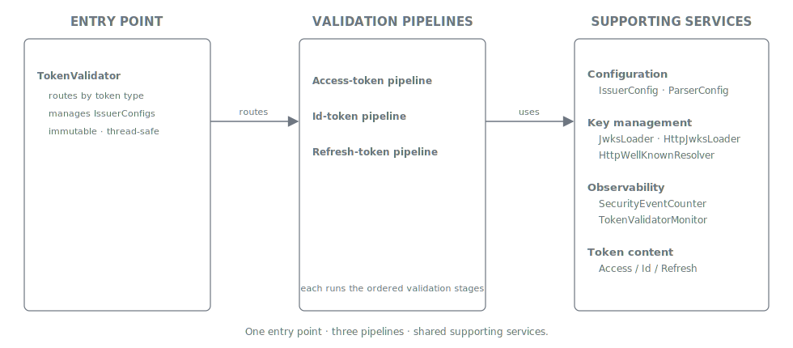
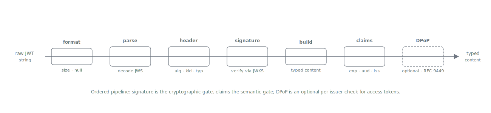
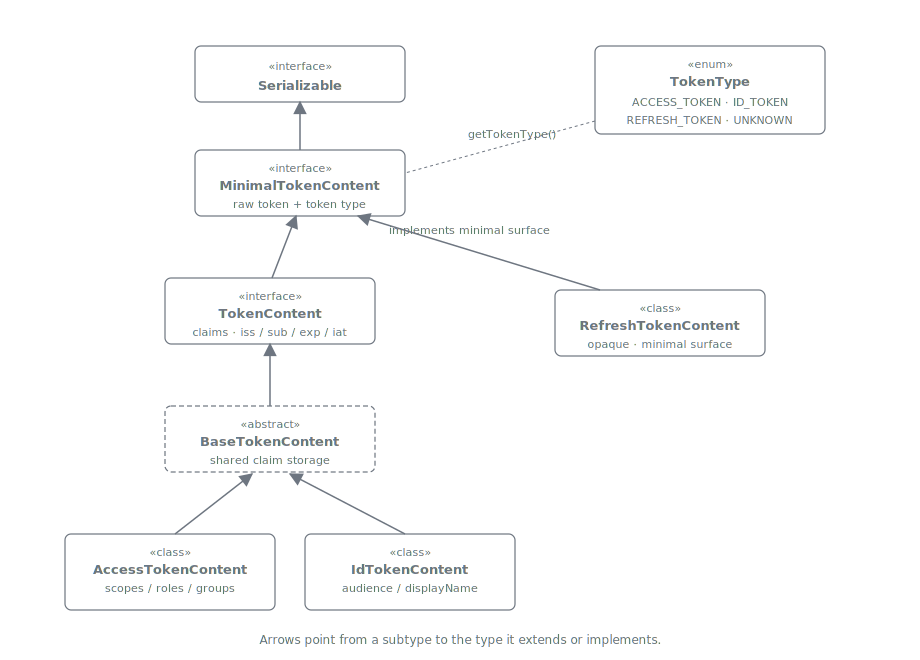

= Token Validation Architecture
:toc: left
:toclevels: 3
:sectnums:
:source-highlighter: highlight.js

== Overview

Token-Sheriff validates JWT tokens through a multi-stage pipeline. This document describes the core components, their interactions, and key design decisions.

[[token-validation-pipeline]]
== Token Validation Pipeline

_See Requirement xref:requirements.adoc#VALIDATION-1[VALIDATION-1: Token Parsing and Validation]_

The `TokenValidator` is the primary entry point. It processes tokens through an ordered pipeline:

0. **TokenStringValidator** - Pre-pipeline validation (null/blank checks, size limits)
1. **NonValidatingJwtParser** - Decodes token structure without cryptographic validation
2. **TokenHeaderValidator** - Validates algorithm, key ID, embedded JWK protection, optional token type per RFC 9068
3. **TokenSignatureValidator** - Verifies cryptographic signature using JWKS
4. **TokenBuilder** - Creates typed token content objects
5. **TokenClaimValidator** - Validates claims (expiration, audience, issuer, etc.)
6. **DpopProofValidator** - Optional per-issuer DPoP proof validation per RFC 9449 (access tokens only)

When `JweDecryptionConfig` is configured on `TokenValidator`, `NonValidatingJwtParser` transparently handles JWE (5-part) tokens: it decrypts the JWE using `JweDecryptor`, extracts the inner JWS, and feeds it through the existing pipeline. See xref:specification/token-decryption.adoc[Token Decryption] for details.

This pipeline provides separation of concerns, clear error signaling through `TokenValidationException`, and comprehensive security coverage.

=== Exception-based Validation

The pipeline uses `TokenValidationException` for error handling, encapsulating:

* **EventType** - The security event type (integrated with `SecurityEventCounter`)
* **EventCategory** - `INVALID_STRUCTURE`, `INVALID_SIGNATURE`, or `SEMANTIC_ISSUES`
* A detailed error message

== Component Specifications

=== TokenValidator

_See Requirement xref:requirements.adoc#VALIDATION-2[VALIDATION-2: Token Representation]_

The `TokenValidator` manages multiple `IssuerConfig` instances, selects the appropriate configuration for each token, and orchestrates the validation pipeline. It is immutable and thread-safe after construction.

[[token-structure]]
[[token-types]]
=== Token Architecture and Types

_See Requirement xref:requirements.adoc#VALIDATION-1.2[VALIDATION-1.2: Token Types]_

* **TokenContent** / **BaseTokenContent** - Core interface and abstract base for JWT tokens
* **AccessTokenContent** - OAuth2 access token with scope and role support
* **IdTokenContent** - OpenID Connect ID token for user identity
* **RefreshTokenContent** - Refresh token with minimal validation (implements `MinimalTokenContent`; if JWT-formatted, claims are extracted but no cryptographic signature verification or claim validation is performed)

[[multi-issuer]]
=== IssuerConfig and Multi-Issuer Support

_See Requirement xref:requirements.adoc#VALIDATION-3[VALIDATION-3: Multi-Issuer Support]_

image::../plantuml/multi-issuer-support.png[Multi-Issuer Support]

Each `IssuerConfig` holds everything needed to validate tokens from one issuer:

* Issuer identifier (explicit or auto-discovered from well-known)
* Expected audience and client ID
* JWKS configuration (HTTP, file, or in-memory)
* Algorithm preferences and custom claim mappers

Configuration validation happens at `build()` time (fail-fast). JwksLoader initialization is a separate phase requiring a `SecurityEventCounter`.

[[jwks-integration]]
=== JwksLoader and Key Management

_See Requirement xref:requirements.adoc#VALIDATION-4[VALIDATION-4: Key Management]_

image::../plantuml/key-management.png[Key Management]

The `JwksLoader` interface handles retrieval, caching, and rotation of cryptographic keys. Implementations:

* **HttpJwksLoader** - Fetches keys via HTTPS with ETag caching (`ETagAwareHttpAdapter` from cui-http-client) and resilient retry (`ResilientHttpAdapter` from cui-http-client). Initialization via `initJWKSLoader()` returns `CompletableFuture<LoaderStatus>` for async startup; key retrieval via `getKeyInfo()` is synchronous.
* **JWKSKeyLoader** - In-memory and file-based key loading.
* **JwksLoaderFactory** - Factory for creating loader instances.

Key features:

* **Key rotation grace period** (default 5 min) - Retired keys remain valid during transition
* **ETag caching** - `If-None-Match` headers minimize bandwidth
* **Background refresh** - Configurable automatic JWKS refresh
* **Thread-safe** - Lock-free `AtomicReference` for status and content

=== OIDC Discovery

_See Requirement xref:requirements.adoc#VALIDATION-4.1[VALIDATION-4.1: JWKS Endpoint Support]_

`HttpWellKnownResolver` fetches `/.well-known/openid-configuration` documents and caches the result using lock-free `AtomicReference`. The discovered `issuer` field is used by `IssuerConfigCache` for issuer matching, and the discovered `jwks_uri` is used by `HttpJwksLoader` to fetch public keys.

[[securityeventcounter]]
=== SecurityEventCounter

_See Requirement xref:requirements.adoc#VALIDATION-7.3[VALIDATION-7.3: Security Events]_

Thread-safe counter for security events during token processing. Created by `TokenValidator` and passed to all pipeline components and `JwksLoader` implementations. Follows the same naming scheme as `JWTValidationLogMessages` for correlation between logs and metrics.

=== TokenValidatorMonitor

High-performance, lock-free monitoring of validation pipeline metrics with microsecond precision. Measures the validation pipeline steps: `COMPLETE_VALIDATION`, `TOKEN_FORMAT_CHECK`, `TOKEN_PARSING`, `ISSUER_EXTRACTION`, `CACHE_LOOKUP`, `ISSUER_CONFIG_RESOLUTION`, `HEADER_VALIDATION`, `SIGNATURE_VALIDATION`, `TOKEN_BUILDING`, `CLAIMS_VALIDATION`, `CACHE_STORE`. Exposed as Micrometer counters in Quarkus (`sheriff.token.validation.errors`, `sheriff.token.validation.success`).

== Size Limits

[cols="1,1,2", options="header"]
|===
|Parameter |Default |Purpose
|`maxTokenSize` |8 KB |Entire JWT string before processing (JWS)
|`maxEncryptedTokenSize` |32 KB |Entire JWE string before processing (when `JweDecryptionConfig` is configured)
|`maxPayloadSize` |8 KB |Each Base64-decoded part
|`maxStringLength` |4 KB |Individual JSON string values (DSL-JSON enforced)
|===

== References

* xref:requirements.adoc[Requirements]
* xref:security-reference.adoc[Security Reference]
* xref:specification/token-decryption.adoc[Token Decryption (JWE)]
