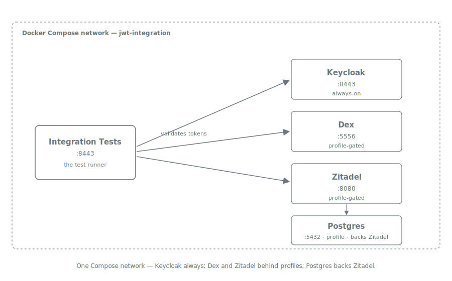

= Multi-IDP Integration Testing
:toc: left
:toclevels: 3
:sectnums:
:source-highlighter: highlight.js
:toc-title: Table of Contents

== Overview

TokenSheriff validates JWT tokens from any standards-compliant OIDC provider. To verify this claim beyond a single provider, multi-IDP integration testing exercises the validation pipeline against multiple identity providers running simultaneously.

This specification covers the architecture, provider selection, and usage of the multi-IDP testing infrastructure.

== Architecture

The multi-IDP testing approach extends the existing Docker Compose infrastructure with additional OIDC providers behind a Docker Compose **profile**, keeping the default Keycloak-only workflow unchanged.

=== Design Principles

1. **Profile isolation** — Additional providers only start when explicitly requested via `COMPOSE_PROFILES=multi-idp`
2. **Capability-based filtering** — Each provider declares capabilities (e.g. `JWT_ACCESS_TOKENS`, `ROLES`). Tests declare required capabilities via `@MethodSource` — providers missing capabilities are skipped with an INFO log, not silently hidden
3. **Shared certificates** — All providers use the same TLS certificate (SAN includes all hostnames)
4. **Pluggable token acquisition** — `TestRealm` delegates to provider-specific token acquisition: ROPC (`grant_type=password`) for Keycloak and Dex, `client_credentials` grant for Zitadel

== Provider Inventory

|===
|Provider |Status |Image Size |Startup Time |Dependencies |Notes

|**Keycloak**
|Active (default)
|~350MB
|~30s
|None
|Full-featured, Keycloak-specific tests (roles, groups, DPoP, JWE)

|**Dex**
|Active (Phase 1)
|~30MB
|~2s
|None (memory storage)
|Lightweight, OpenID Certified, ROPC via `passwordConnector`. Federation broker with fixed claim model — supports groups but not roles or custom scopes (see <<dex-limitations>>).

|**Zitadel**
|Active (Phase 2)
|~100MB
|~40s
|PostgreSQL 17
|Full-featured, OpenID Certified (Apache 2.0). Supports roles (via project grants), groups (via Actions + user metadata), JWT access tokens. Does not support ROPC — uses `client_credentials` grant instead. Does not support custom scopes (only standard OIDC + URN scopes). See <<zitadel-details>>.

|FusionAuth
|Deferred
|~400MB
|~15s
|PostgreSQL
|Proprietary license concerns

|Ory Hydra
|Deferred
|~20MB
|~5s
|External login UI
|Requires separate login/consent app

|Authentik
|Deferred
|~500MB
|~30s
|PostgreSQL + Redis
|Heaviest setup, most realistic for enterprise
|===

== Usage

=== Keycloak-Only (Default)

No change to existing workflow:

[source,bash]
----
./mvnw clean verify -Pintegration-tests \
    -pl token-sheriff-quarkus-parent/token-sheriff-quarkus-integration-tests -am
----

Dex is not in the provider list — only Keycloak tests run.

=== Multi-IDP (Keycloak + Dex + Zitadel)

[source,bash]
----
./mvnw clean verify -Pmulti-idp-tests \
    -pl token-sheriff-quarkus-parent/token-sheriff-quarkus-integration-tests -am
----

This starts Keycloak, Dex, and Zitadel (with PostgreSQL), sets `QUARKUS_PROFILE=multi-idp` on the app container and `-Ddex.enabled=true -Dzitadel.enabled=true` in the test JVM. All providers are included in the provider list and run through applicable specs based on their capabilities.

=== Manual Testing

[source,bash]
----
# Start all providers
COMPOSE_PROFILES=multi-idp docker compose up -d

# Verify Dex
curl -k https://localhost:2556/dex/.well-known/openid-configuration

# Verify Zitadel
curl -s -H "Host: zitadel:3080" http://localhost:3080/.well-known/openid-configuration

# Acquire Dex token via ROPC (include groups scope for group claims)
curl -k -X POST https://localhost:2556/dex/token \
    -d "grant_type=password&client_id=dex-client&client_secret=dex-secret&username=dex-user@example.com&password=dex-password&scope=openid+profile+email+groups"

# Run Zitadel setup (generates credentials)
PAT_FILE=/tmp/zitadel-admin-pat/zitadel-admin-sa.pat OUTPUT_DIR=. \
    bash src/main/docker/zitadel/setup.sh
----

== Adding a New Provider

Checklist for adding a new OIDC provider:

1. **Docker Compose** — Add service to `docker-compose.yml` under the `multi-idp` profile
2. **Certificate SAN** — Add `dns:<hostname>` to `generate-certificates.sh` SAN list and regenerate
3. **Application Properties** — Add issuer configuration with `%multi-idp.` Quarkus profile prefix in `application.properties`
4. **TestRealm Factory** — Add `createXxxProvider()` factory method declaring capabilities
5. **TestProviders Registry** — Add `ProviderRegistration` entry mapping system property to factory
6. **Maven POM** — Add `<xxx.enabled>true</xxx.enabled>` to failsafe `systemPropertyVariables` in the multi-idp-tests profile
7. **Startup Script** — Add health wait loop for the new provider in `start-integration-container.sh`
8. **Documentation** — Update this specification and the integration tests README

== Test Scope by Provider

|===
|Test |Keycloak |Dex |Zitadel |Rationale

|Access token validation
|Yes
|Yes
|Yes
|All three produce RS256-signed JWT access tokens

|ID token validation
|Yes
|Yes
|Yes
|Core functionality

|Refresh token validation
|Yes
|Yes (with offline_access)
|Yes
|All providers support refresh tokens

|Bearer with-roles
|Yes
|No
|No
|Keycloak: realm roles. Dex has no roles concept. Zitadel Actions are configured but not yet exercised in tests (see <<zitadel-details>>).

|Bearer with-groups
|Yes
|No
|No
|Keycloak: group mappers. Dex has groups but the test also requires roles. Zitadel Actions are configured but not yet exercised in tests.

|Bearer with-scopes
|Yes
|No
|No
|Only Keycloak supports custom scopes (e.g. "read"). Zitadel only accepts standard OIDC + URN scopes.

|Bearer with-all
|Yes
|No
|No
|Requires ROLES + GROUPS + CUSTOM_SCOPES — only Keycloak qualifies

|DPoP (RFC 9449)
|Yes
|No
|No
|Keycloak-specific feature

|JWE decryption (RFC 7516)
|Yes
|No
|No
|Keycloak-specific feature

|Health checks
|Yes
|N/A
|N/A
|Application-level, provider-independent

|Metrics
|Yes
|N/A
|N/A
|Application-level, provider-independent
|===

[[dex-limitations]]
== Dex Capability Limitations

Dex is an OIDC **federation broker**, not a full identity provider. Its local connector (`staticPasswords`) is a bootstrapping convenience with a fixed claim model. This creates hard limitations that are **not configurable** — they are coded into Dex's Go source.

=== What Dex supports

* **Groups** — The `Password` struct has a `Groups` field. Groups are included in tokens when the `groups` scope is requested. The static test user is configured with `test-group`.
* **Standard OIDC scopes** — `openid`, `email`, `groups`, `profile`, `offline_access`

=== What Dex cannot support

* **Custom scopes** (e.g. `read`) — Dex hardcodes accepted scopes in a Go switch statement. Unknown scopes are rejected with HTTP 400 (`Unrecognized scope(s)`). There is no configuration to add custom scopes.
* **Roles claim** — The `idTokenClaims` struct has no `Roles` field. The local connector's `Password` struct has `Groups` but no mechanism for arbitrary custom claims. Even with an upstream OIDC connector, Dex normalizes claims into its fixed model — upstream `roles` claims are dropped.
* **Scope claim in tokens** — Dex does not include a `scope` claim in its JWTs. This is valid per RFC 9068 but means scope-based bearer auth tests cannot run against Dex.

=== Implications for bearer auth tests

The `bearerAuthProviders()` method source requires `ROLES + GROUPS + CUSTOM_SCOPES`. Dex has `GROUPS` but cannot provide `ROLES` or `CUSTOM_SCOPES`. Zitadel fills this gap — it participates in roles-only and groups-only bearer tests via the split capability gates in `BearerAuthSpecIT`.

=== Dex's value in the test suite

Despite these limitations, Dex proves that TokenSheriff correctly handles:

* A **different OIDC-certified issuer** with different token structure
* **Missing optional claims** (no `scope` claim — RFC 9068 compliance)
* **Groups** from a non-Keycloak provider
* **Multiple simultaneous issuers** in the validation pipeline

[[zitadel-details]]
== Zitadel Integration Details

Zitadel (Apache 2.0, OpenID Certified) is a full-featured identity provider that extends bearer auth test coverage beyond what Dex can provide.

=== Token Acquisition: Client Credentials

Zitadel does not support ROPC (`grant_type=password`), which is deprecated in OAuth 2.1. Instead, token acquisition uses the `client_credentials` grant — a service account authenticates directly to obtain a JWT access token.

Note: The `client_credentials` grant does not return an ID token. ID token validation tests are skipped for Zitadel accordingly.

=== Setup: Imperative API Configuration

Unlike Keycloak (declarative realm JSON import), Zitadel requires imperative configuration via its Management API. The `src/main/docker/zitadel/setup.sh` script runs after Zitadel starts and creates:

* A project with `user` and `admin` roles
* An OIDC application with JWT access tokens and token exchange grant
* A human user (`zitadel-user@example.com`) with the `user` role
* A service account with impersonation permission
* Zitadel Actions (server-side JavaScript) that inject:
** `roles` — flat array from project role grants
** `groups` — from user metadata

Credentials are written to `target/zitadel-credentials.properties`, consumed by `TestRealm.createZitadelProvider()`.

=== Capabilities

|===
|Capability |Supported |Notes

|ROLES |Configured, not yet tested |Actions flatten project role grants into `roles` claim, but `ROLES` capability is not yet declared in `TestRealm` — Zitadel Actions v1 don't populate grants in `client_credentials` flow
|GROUPS |Configured, not yet tested |Actions inject user metadata as `groups` claim, but `GROUPS` capability is not yet declared in `TestRealm`
|JWT_ACCESS_TOKENS |Yes |Configurable per application (default opaque, set to JWT)
|CUSTOM_SCOPES |No |Zitadel only accepts standard OIDC + its own URN-based scopes
|OFFLINE_ACCESS |No |Not exercised in current test suite
|===

=== Dependencies

* **PostgreSQL 17** — Zitadel requires a relational database (no embedded option like CockroachDB in older versions)
* **Startup time** — ~40s (PostgreSQL + Zitadel init + setup script)
* **Image size** — ~100MB (Zitadel) + ~80MB (PostgreSQL Alpine)

== References

* xref:../../../token-sheriff-quarkus-parent/token-sheriff-quarkus-integration-tests/README.adoc[Integration Tests README]
* xref:../requirements.adoc#VALIDATION-12.3[VALIDATION-12.3: Integration Testing]
* https://dexidp.io/docs/[Dex Documentation]
* https://zitadel.com/docs[Zitadel Documentation]
* https://openid.net/certification/[OpenID Certification]
