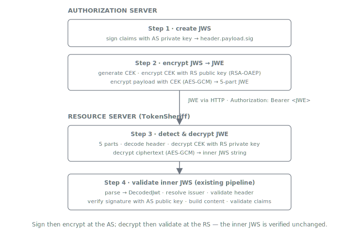
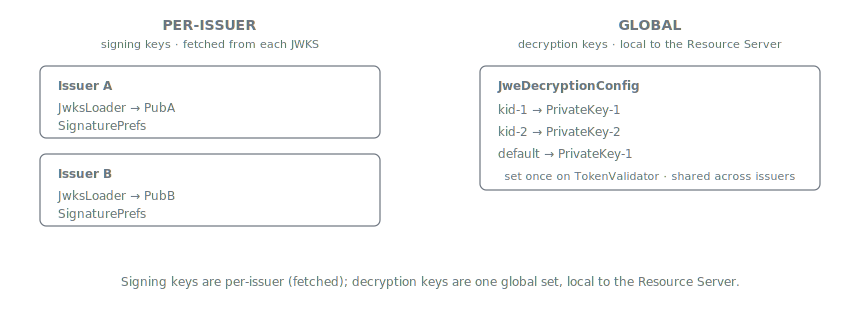
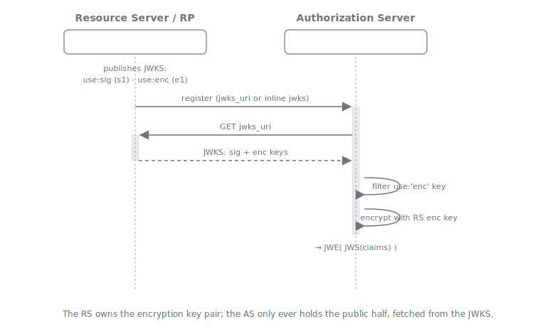
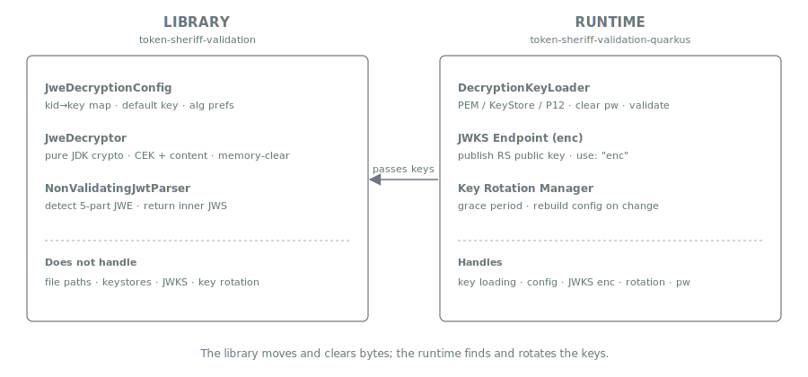
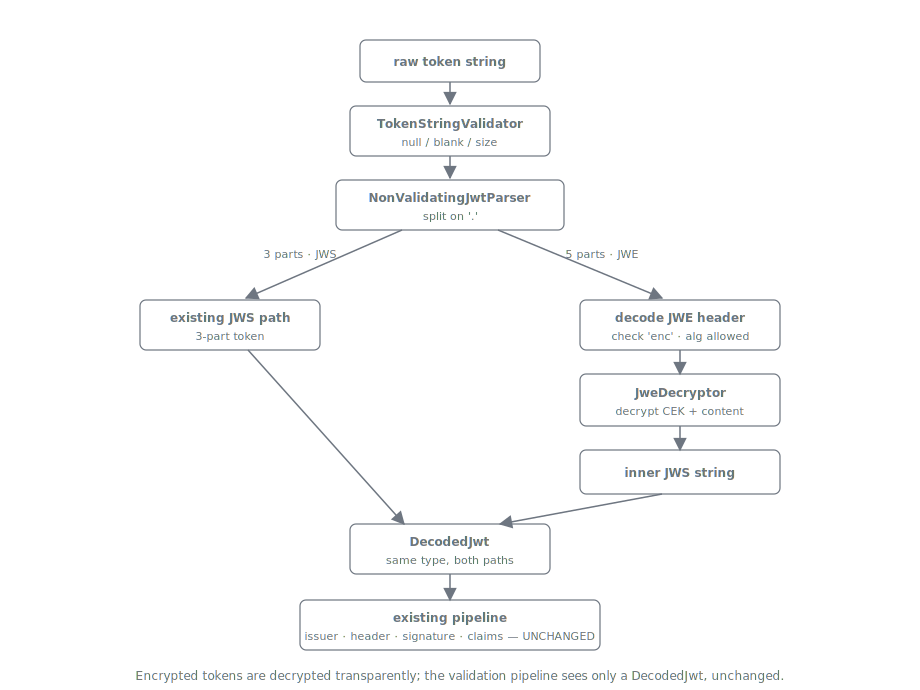
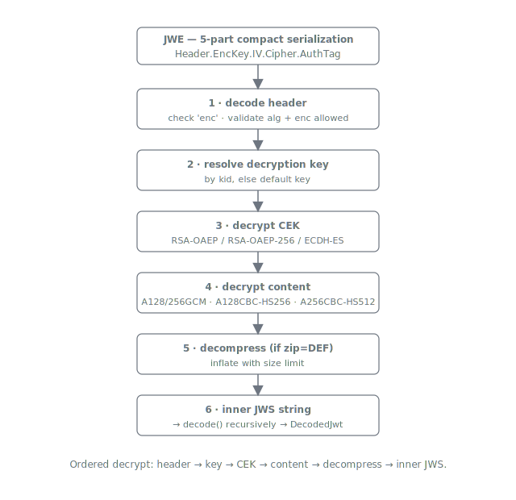

= JWT Token Decryption
:toc: left
:toclevels: 3
:toc-title: Table of Contents
:sectnums:
:source-highlighter: highlight.js

xref:../architecture.adoc[Back to Architecture Reference]

== Overview
_See Requirement xref:../requirements.adoc#VALIDATION-1.4[VALIDATION-1.4: Token Decryption]_

=== Document Navigation

* link:../../../README.md[README] - Project overview and introduction
* xref:../../../token-sheriff-validation/README.adoc[Usage Guide] - How to use the library with code examples
* xref:../requirements.adoc[Requirements] - Functional and non-functional requirements
* xref:../architecture.adoc[Architecture] - Architecture reference and implementation details
* xref:../../LogMessages.adoc[Log Messages] - Reference for all log messages
* xref:../security-reference.adoc[Security Reference] - Security measures

==== Status: IMPLEMENTED

This document describes the JWE (JSON Web Encryption, https://datatracker.ietf.org/doc/html/rfc7516[RFC 7516]) decryption support in the JWT Token Validation library. JWE decryption is transparent — encrypted tokens are decrypted and then validated through the existing pipeline unchanged.

== OAuth JWE End-to-End Flow

The Authorization Server signs a JWT with its private key, then encrypts it using the Resource Server's public key. The Resource Server decrypts with its private key, then validates the inner JWS through the existing pipeline.

== Key Material Locations

[cols="1,1,2", options="header"]
|===
|Key |Held By |Purpose

|AS Signing Private Key
|Authorization Server
|Sign JWS tokens (RS256, ES256, etc.)

|AS Signing Public Key
|Resource Server (via JWKS)
|Verify JWS signature, loaded by JwksLoader

|RS Encryption Public Key
|Authorization Server
|Encrypt CEK in JWE (RSA-OAEP, ECDH-ES)

|RS Decryption Private Key
|Resource Server (LOCAL config)
|Decrypt CEK from JWE, configured in `JweDecryptionConfig`

|Content Encryption Key (CEK)
|Ephemeral (per-token)
|Encrypt/decrypt JWS payload (A256GCM, A128CBC-HS256). Generated by AS, encrypted in JWE encrypted key part
|===

=== Why Decryption Keys Are at TokenValidator Level (Not Per-Issuer)

The decryption private key belongs to *this* Resource Server — it is the same key regardless of which Authorization Server encrypted the token. Multiple issuers may encrypt with different `kid` values referencing different public keys, but the corresponding private keys are all local to the Resource Server. This is fundamentally different from signing keys (which are per-issuer, loaded from each issuer's JWKS endpoint).

== OIDC Key Exchange

In a production OIDC deployment, the Resource Server publishes its encryption public key via a JWKS endpoint (with `use: "enc"`). The Authorization Server fetches this key and uses it to encrypt tokens.

=== Key Discovery Mechanisms

[cols="1,2,1", options="header"]
|===
|Mechanism |Description |Key Rotation?

|`jwks_uri` on client registration
|RS publishes JWKS endpoint, AS fetches it
|Yes (AS re-fetches)

|`jwks` inline in client config
|JWK Set stored directly in AS
|No (manual update)

|Manual upload
|Certificate/key uploaded via Admin Console
|No (manual update)
|===

No new JWKS fetching is needed for decryption keys — the library only needs the local private key. This is fundamentally different from JWS verification where we fetch the AS's public keys from their JWKS endpoint.

== Core vs Quarkus Responsibility Split

== Internal Pipeline Architecture

JWE decryption is transparent — it happens inside `NonValidatingJwtParser` and produces a standard `DecodedJwt`. All downstream validators work on the inner JWS unchanged.

== Detailed JWE Decryption Flow

== Supported Algorithms

=== Key Management Algorithms (alg header)

[cols="1,2,1", options="header"]
|===
|Algorithm |JDK Crypto |Notes

|RSA-OAEP
|`Cipher("RSA/ECB/OAEPWithSHA-1AndMGF1Padding")`
|Keycloak default

|RSA-OAEP-256
|`Cipher("RSA/ECB/OAEPPadding")` + `OAEPParameterSpec("SHA-256", "MGF1", MGF1ParameterSpec.SHA256, PSource.PSpecified.DEFAULT)`
|Recommended for Open Finance

|ECDH-ES
|`KeyAgreement("ECDH")` + ConcatKDF (NIST SP 800-56A)
|Direct key agreement
|===

=== Content Encryption Algorithms (enc header)

[cols="1,2,1", options="header"]
|===
|Algorithm |JDK Crypto |Key Size

|A128GCM
|`Cipher("AES/GCM/NoPadding")` + `GCMParameterSpec(128, iv)`
|128-bit CEK

|A256GCM
|`Cipher("AES/GCM/NoPadding")` + `GCMParameterSpec(128, iv)`
|256-bit CEK

|A128CBC-HS256
|`Cipher("AES/CBC/PKCS5Padding")` + `Mac("HmacSHA256")`
|256-bit CEK (split)

|A256CBC-HS512
|`Cipher("AES/CBC/PKCS5Padding")` + `Mac("HmacSHA512")`
|512-bit CEK (split)
|===

=== Rejected Algorithms

[cols="1,2", options="header"]
|===
|Algorithm |Reason

|RSA1_5
|Vulnerable to Bleichenbacher's padding oracle attack (CVE-2012-5081)
|===

== Configuration

`JweDecryptionConfig` accepts only `java.security.PrivateKey` objects. Key loading is the Quarkus module's responsibility.

[source,java]
----
JweDecryptionConfig config = JweDecryptionConfig.builder()
    .decryptionKey("kid-1", privateKey1)     // kid → PrivateKey
    .decryptionKey("kid-2", privateKey2)     // supports rotation
    .defaultDecryptionKey(privateKey1)        // fallback when no kid
    .build();

TokenValidator validator = TokenValidator.builder()
    .issuerConfig(issuerConfig)
    .jweDecryptionConfig(config)             // optional
    .build();
----

== Security Considerations

=== RSA1_5 Rejection

The RSA1_5 (RSAES-PKCS1-v1_5) key management algorithm is explicitly rejected due to the Bleichenbacher padding oracle attack. `JweAlgorithmPreferences.REJECTED_KEY_ALGORITHMS` is checked before any cryptographic operation.

=== Compression Bomb Protection

When `zip="DEF"` (DEFLATE compression), decompressed content is limited to 256 KB to prevent compression bomb attacks.

=== Constant-Time MAC Comparison

AES-CBC-HS authentication tag validation uses `MessageDigest.isEqual()` for constant-time comparison, preventing timing side-channel attacks.

=== Memory Clearing

CEK and derived key material is cleared (`Arrays.fill(cek, (byte) 0)`) after use to minimize exposure window in memory.

=== Nested JWE Rejection

After decryption, if the result is another 5-part JWE token, the library throws an exception. Only JWE(JWS) nesting is allowed — not JWE(JWE).

=== Private Key Protection in Logging

All `PrivateKey` fields in `JweDecryptionConfig` are annotated with `@ToString.Exclude` to prevent accidental exposure in logs.

== References

* https://datatracker.ietf.org/doc/html/rfc7516[RFC 7516 - JSON Web Encryption (JWE)]
* https://datatracker.ietf.org/doc/html/rfc7518[RFC 7518 - JSON Web Algorithms (JWA)]
* https://nvlpubs.nist.gov/nistpubs/SpecialPublications/NIST.SP.800-56Ar3.pdf[NIST SP 800-56A - Recommendation for Pair-Wise Key-Establishment Schemes]
* xref:../architecture.adoc[Architecture Reference]
* xref:../requirements.adoc[Requirements]
